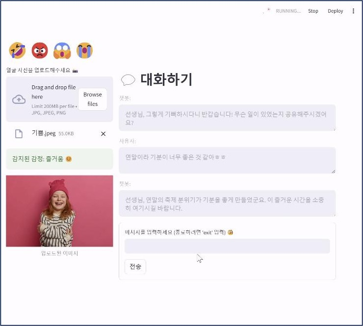

### 사용자 감정을 기반한 심리상담가 챗봇
---
**프로젝트 개요**
> 🗓️ : 2024.11 ~ 2024.12  
> Team : 4인 1팀  
> Role : 표정 이미지 데이터를 이용한 Pre-trained CNN모델 학습, 심리상담가 LLM 구현  
> Contents : 사용자의 얼굴 이미지를 이용해 표정(화남, 슬픔, 행복, 당황함)을 탐지하고 이를 기반으로 심리상담가의 역할을 수행하는 챗봇 구현

---
**프로젝트 기능**
> - 얼굴 표정 이미지 기반 감정 인식 (`슬픔`, `화남`, `당황함`, `즐거움`)
> - 감정에 맞는 상담사 톤의 심리상담 챗봇
> - 감정에 따라 어울리는 한국 노래 추천
> - Streamlit UI 제공

---
**프로젝트 기술&툴**
> 기술 : Tensorflow, Keras, CNN, LangChain, OpenCV, Python  
> 툴 : Visual Studio Code

---
**프로젝트 적용 내용**
> 화남, 슬픔, 행복, 당황함 4가지 클래스 학습된 CNN모델의 .pt파일을 .h5 파일로 변환 후 적용

---
**프로젝트 데모 화면**  

